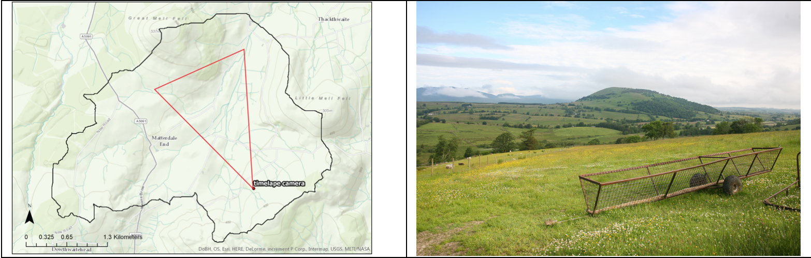
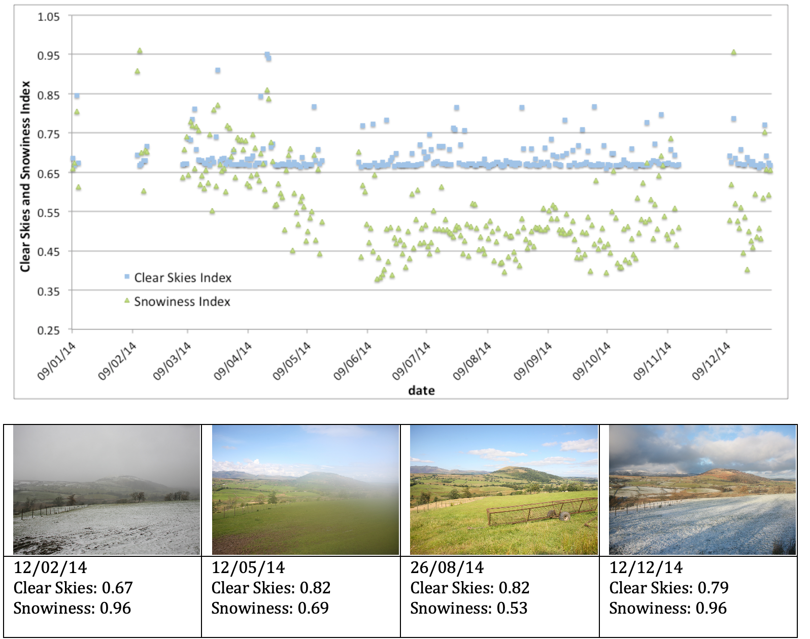
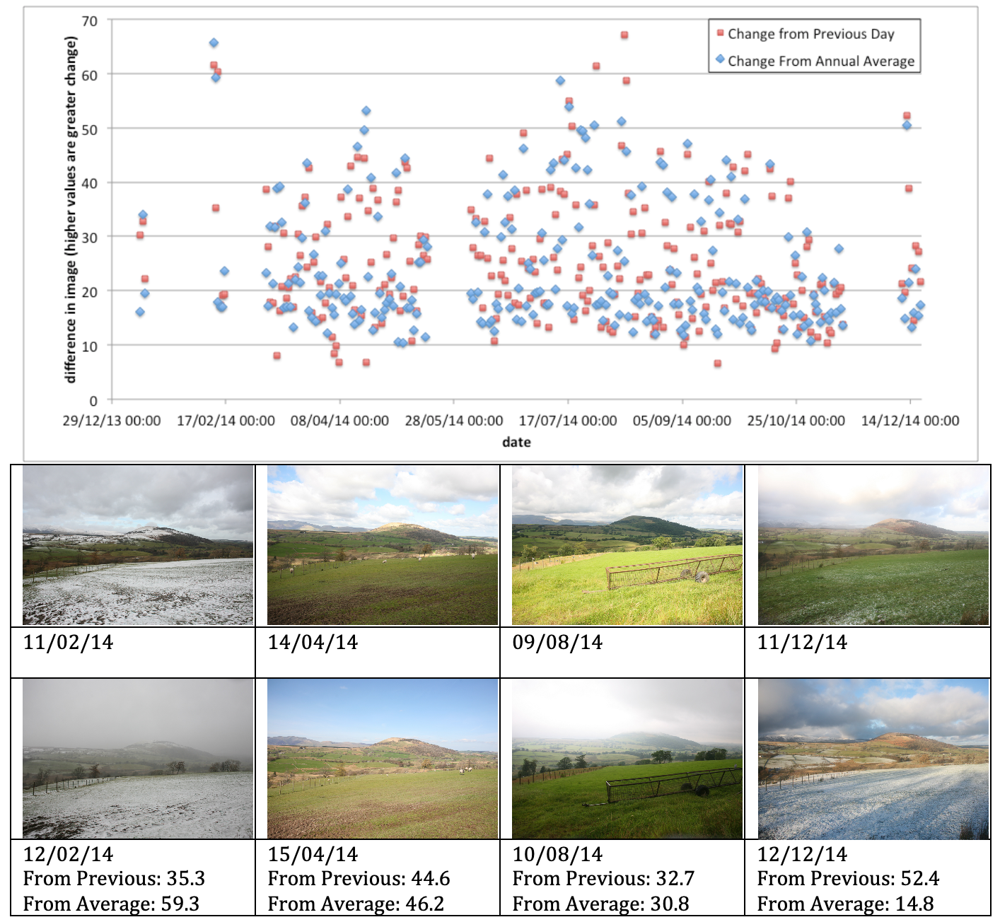
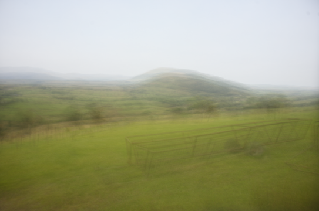

===============================================================================

There are many factors within the landscape that can affect diffuse pollution source risk that vary over the year. Examples include the snow cover dynamics driving overland flow not directly connected to precipitation on that day, the changes in solar receipt resulting from
cloud cover and land cover changes resulting from agricultural
practices. An approach that was trialled within the first phase of DTC
was the use of a time-lapse camera to create a visual record on the
landscape, which could then be processed to give a continuous record of
the factors. It is hoped that this extra information would provide
useful context and background information foe the interpretation of the
in-stream monitoring data.

Location and Equipment
----------------------

A single camera was installed in the Dacre Beck sub-catchment. This
location was selected due to the suitability of the topography for the
approach and local issues with snow melt that are most relevant at this
site. The camera location and a typical image are shown in figure 1
below. The camera installed was a Canon 5D mk I DSLR with a 24mm f2.8
lens set to f5.0 and with a fixed ISO of 200 in aperture priority mode.
This setup gave a horizontal angle of view of 73.7°. The camera was
triggered to take an image every 10 minutes and has been installed since
Jan 2014.

  

Figure 1: The location of the time-lapse camera and a typical acquired
image from the site from 24/06/14. The red triangle in the map shows the
camera direction and angle of view of the images.

Converting Images to Information
--------------------------------

The images have been processed with the Python Image Library and SciPy
to extract information on the changing characteristics of the landscape.
The approach taken for cloud cover and snow cover followed the same
steps:

1.  Define the area of interest within the image for analysis. For the
    clear skies, this an area extracted from the sky and for the snow
    cover, this area was defined as the local foreground field.

2.  A Gaussian blur filter was applied to the image with a high
    radius (200) to give a consistent colour value within the extracted
    area of interest image.

3.  The red, green and blue components of the colour were extracted for
    analysis.

    a.  For 'clear skies', the index was defined as blue / ((green +
        red) / 2) and hence the lower values represent cloudy days and
        higher values one represent blue sky days

    b.  For the 'snowiness', the index was defined as blue / green with
        values towards one representing snow cover

The changes in the overall scene were assessed by comparing the
statistical differences between pairs of images. Two approaches were
tested, the first compared the current day to the previous day and the
second approach compared each day to the averaged scene from the whole
year. The differences between the images were defined as the 'Manhattan'
difference whereby the mean movement in brightness levels per pixel is
calculated after the images have been converted to greyscale and
normalised.

Initial Results
---------------

In figure 2 below, there are the initial results for the 2014 calendar
year for the clear skies and snowiness indexes along with example
images. These initial results are based on the midday images from each
day.

Figure 2 Changes in the clear skies and snowiness index over the 2014 calendar year.

From the results, it can be seen that the snowiness index correctly
identify days with snow cover when the index value exceeds 0.87. There
is a strong seasonal trend in the snowiness index values wit the lowest
values in the summer. The 'blue skies' index shows the high level of
cloud cover year the year with relatively few days being cloud free, 8.5% of days have a index value greater than 0.75. The example image in Figure 2 from 12/05/14 shows issues with condensation within the
waterproof housing of the camera install. This condensation reduces the
image quality for fine detail but it is still possible to extract
information on the sky status.

Figure 3 below shows the changes over time for the daily differences
when compared to the previous day and to the mean image. The mean image
is shown in figure 4.

 3

Figure 3 Changes over time for the daily differences when compared to
the previous day and to the mean image

Figure 4, the average image from all midday images in 2014

From the results in Figure 3 it can be seen that the difference based
indexes are capable of identifying the days of the year were the
landscape or climate are different from the 'normal' conditions. The
approach successfully identified the increased snow cover in February
2014, the occurrence of a change in the weather conditions from cloud to
clear skies in April 2014 and the reverse in August and finally the
occurrence of snowfall in December 2014.

### Concluding Remarks

-   Time-lapse photography of the catchment and landscape has the capability to add significant contextual information to complement and support the in-stream water chemistry datasets

-   The approach generates significant amounts of data and hence tools are needed to identify the important times and associated images

-   The presented indexes in are capable of identify the properties of the environment, such as cloud cover or snow accumulation / melt.

-   It is also possible to identify times when there have been large changes in the landscape, either compared to the previous day or to the annual average conditions.
